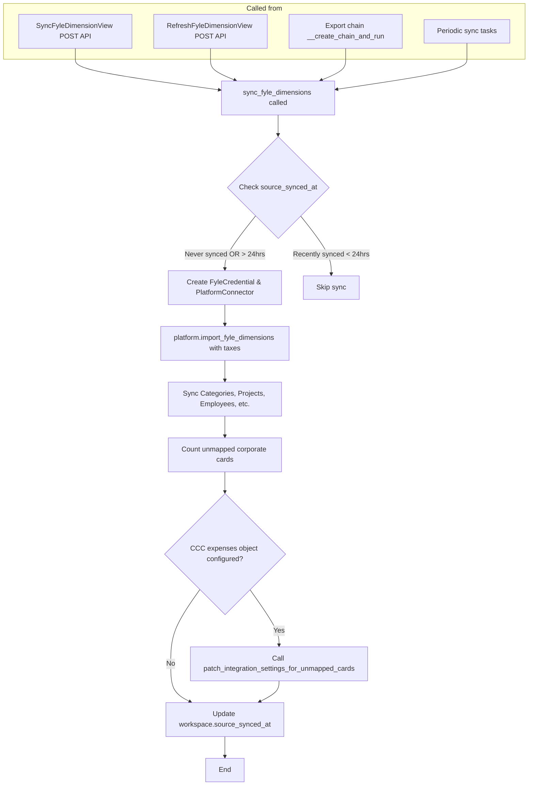
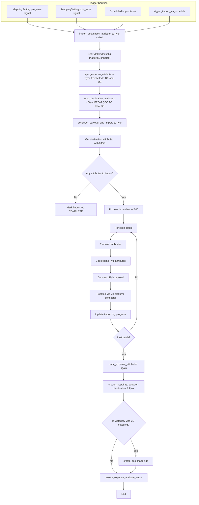
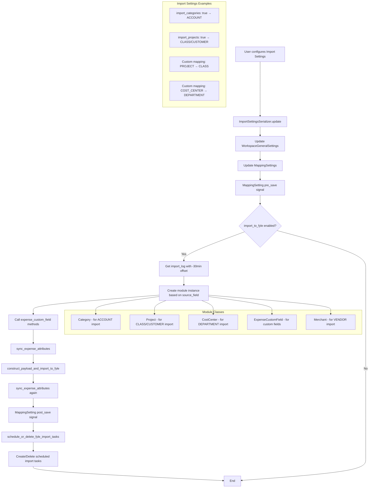
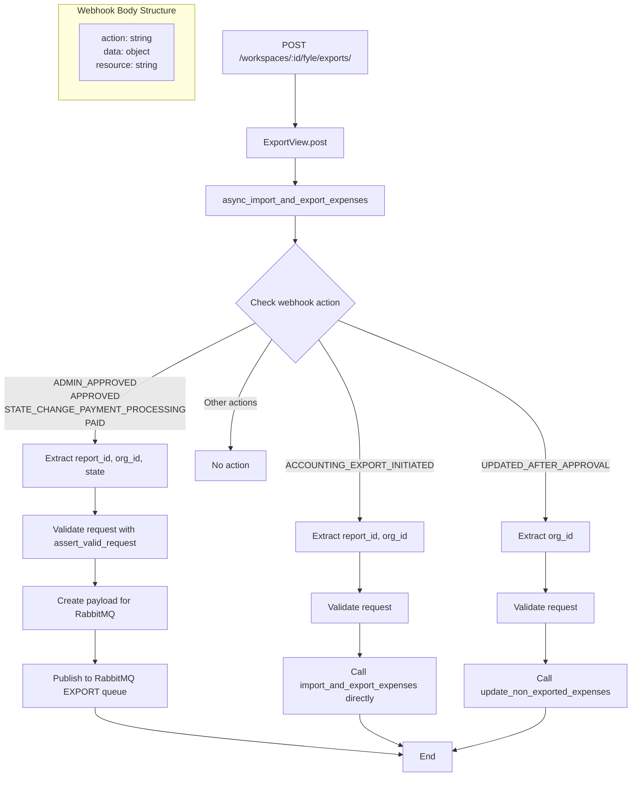
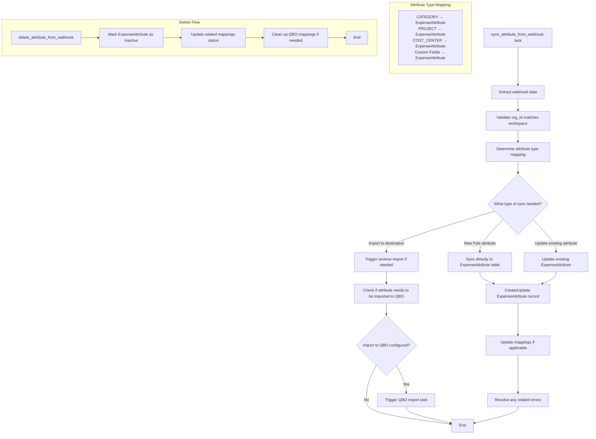
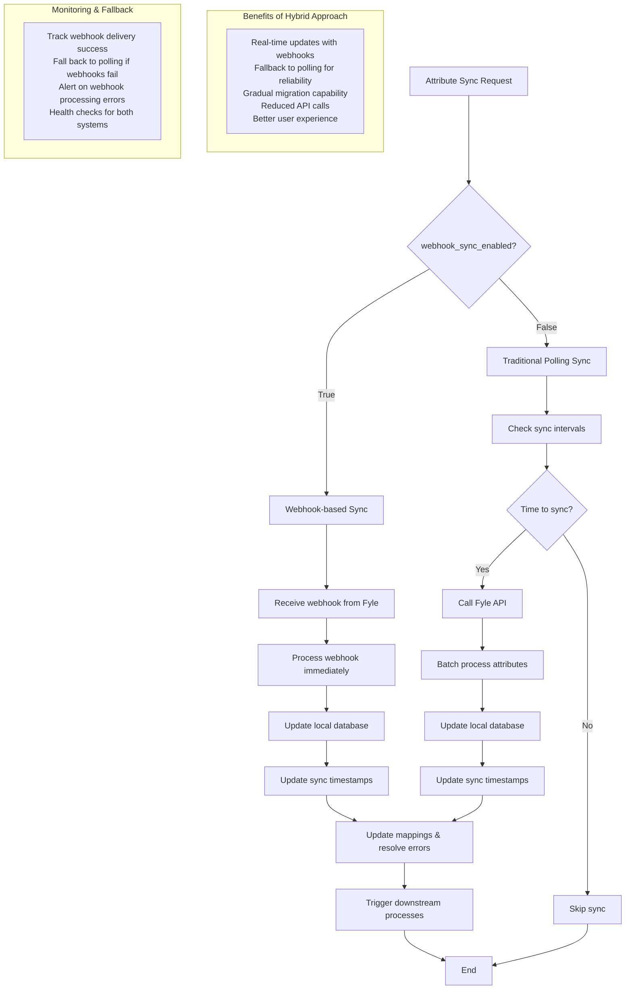

# Fyle-QBO Attribute Synchronization Architecture

## Overview

This document outlines the current architecture for attribute synchronization between Fyle, the integration database, and QuickBooks Online (QBO). It also proposes a webhook-based architecture to replace the current polling-based system for Fyle attribute synchronization.

## Current Architecture Flows

### 1. Sync Fyle Dimensions Flow

The `sync_fyle_dimensions` function is responsible for importing/syncing attributes FROM Fyle TO the integration database.



**Key Points:**
- Triggered manually via API endpoints or automatically during exports
- Uses 24-hour interval check to avoid over-syncing
- Imports ALL Fyle dimensions (categories, projects, employees, etc.) to local DB
- Updates workspace.source_synced_at timestamp

### 2. Import Destination Attributes to Fyle Flow

This is the reverse flow - importing attributes FROM QBO TO Fyle when mapping settings are configured.



**Key Points:**
- Triggered by mapping setting changes or scheduled tasks
- Syncs QBO attributes (accounts, items, classes, etc.) to Fyle
- Creates bidirectional mappings after import
- Processes in batches to handle large datasets
- Uses import logs to track progress and prevent duplicates

### 3. Mapping Settings and Trigger Flow

Shows how mapping settings control which attributes get imported to Fyle.



**Key Points:**
- Mapping settings determine which QBO attributes get imported to Fyle
- Different module classes handle different attribute types
- Pre/post save signals orchestrate the import process
- Scheduled tasks ensure regular syncing based on configuration

### 4. Current Webhook Infrastructure

Shows the existing webhook handling in the exports endpoint.



**Key Points:**
- Single endpoint handles multiple webhook action types
- Currently handles expense/report related webhooks only
- Uses both direct async_task calls and RabbitMQ for processing
- Validates org_id matches workspace before processing

## Proposed Webhook-Based Architecture

### 1. Enhanced Webhook Handler

Extend the existing webhook infrastructure to handle attribute webhooks:

```mermaid
graph TD
    A[POST /workspaces/:id/fyle/exports/] --> B[ExportView.post]
    B --> C[async_import_and_export_expenses]
    C --> D{Check webhook action & resource}

    %% Existing flows
    D -->|EXPENSE/REPORT actions| E[Handle expense webhooks<br/>(existing logic)]

    %% New attribute flows
    D -->|CREATED + CATEGORY| F[Handle category creation]
    D -->|CREATED + PROJECT| G[Handle project creation]
    D -->|CREATED + COST_CENTER| H[Handle cost center creation]
    D -->|CREATED + Custom Field| I[Handle custom field creation]
    D -->|DELETE + Any attribute| J[Handle attribute deletion]

    F --> K[Check if webhook_sync_enabled in WorkspaceGeneralSettings]
    G --> K
    H --> K
    I --> K
    J --> L[Check if webhook_sync_enabled]

    K --> M{Webhook sync enabled?}
    L --> N{Webhook sync enabled?}

    M -->|Yes| O[async_task: sync_attribute_from_webhook]
    M -->|No| P[Skip - use traditional polling]
    N -->|Yes| Q[async_task: delete_attribute_from_webhook]
    N -->|No| P

    O --> R[End]
    Q --> R
    P --> R
    E --> R

    subgraph "New Webhook Body Examples"
        S["CREATE:
        {
          action: 'CREATED',
          resource: 'CATEGORY',
          data: {
            id: 123,
            org_id: 'orXX',
            name: 'Travel',
            is_enabled: true,
            ...
          }
        }"]

        T["DELETE:
        {
          action: 'DELETE',
          resource: 'CATEGORY',
          data: {
            org_id: 'orXX',
            id: 123
          }
        }"]
    end
```

### 2. New Webhook Processing Tasks



### 3. Enhanced WorkspaceGeneralSettings

Add webhook configuration to the settings model:

```mermaid
graph TD
    A[WorkspaceGeneralSettings Model] --> B[Existing Fields]
    A --> C[New Webhook Fields]

    B --> D[import_categories<br/>import_projects<br/>import_tax_codes<br/>import_vendors_as_merchants<br/>etc.]

    C --> E[webhook_sync_enabled: BooleanField<br/>webhook_sync_categories: BooleanField<br/>webhook_sync_projects: BooleanField<br/>webhook_sync_cost_centers: BooleanField<br/>webhook_sync_custom_fields: BooleanField]

    F[Import Settings API] --> G[User configures webhook settings]
    G --> H{Enable webhook sync?}
    H -->|Yes| I[webhook_sync_enabled = True]
    H -->|No| J[webhook_sync_enabled = False<br/>Use traditional polling]

    I --> K[Configure specific attribute types]
    K --> L[Save settings]
    J --> L
    L --> M[Triggers update scheduled tasks]

    subgraph "Migration Strategy"
        N[Phase 1: Add webhook fields with default=False]
        O[Phase 2: Gradual rollout per workspace]
        P[Phase 3: Default=True for new workspaces]
        Q[Phase 4: Deprecate polling (optional)]
    end
```

### 4. Hybrid Sync Architecture

Support both webhook and polling-based sync during transition:



## Implementation Plan

### Phase 1: Infrastructure Setup
1. Add webhook configuration fields to `WorkspaceGeneralSettings`
2. Create database migrations
3. Update import settings serializers and APIs
4. Add webhook processing tasks

### Phase 2: Webhook Handler Extension
1. Extend `async_import_and_export_expenses` to handle attribute webhooks
2. Implement attribute-specific processing logic
3. Add validation and error handling
4. Create monitoring and logging

### Phase 3: Testing & Rollout
1. Create comprehensive tests for webhook flows
2. Implement feature flags for gradual rollout
3. Add monitoring dashboards
4. Performance testing and optimization

### Phase 4: Migration Strategy
1. Enable webhooks for pilot workspaces
2. Monitor performance and reliability
3. Gradual rollout to all workspaces
4. Optional: Deprecate polling mechanism

## Key Benefits of Webhook Architecture

1. **Real-time Updates**: Immediate sync when attributes change in Fyle
2. **Reduced API Calls**: No need for periodic polling
3. **Better Performance**: Lower latency and resource usage
4. **Scalability**: Can handle high-frequency attribute changes
5. **User Experience**: Changes reflect immediately in the integration
6. **Cost Efficiency**: Fewer API calls reduce infrastructure costs

## Security Considerations

1. **Webhook Validation**: Verify webhook signatures from Fyle
2. **Rate Limiting**: Implement rate limits for webhook endpoints
3. **Idempotency**: Handle duplicate webhook deliveries gracefully
4. **Error Handling**: Robust error handling and retry mechanisms
5. **Monitoring**: Track webhook processing success/failure rates

## Migration Path

The hybrid architecture allows for a smooth transition:

1. **Current State**: Only polling-based sync
2. **Transition State**: Both webhook and polling available (controlled by settings)
3. **Future State**: Primarily webhook-based with polling as fallback
4. **End State**: Webhook-only (optional, based on reliability metrics)

This approach ensures zero downtime and provides flexibility to rollback if needed.
